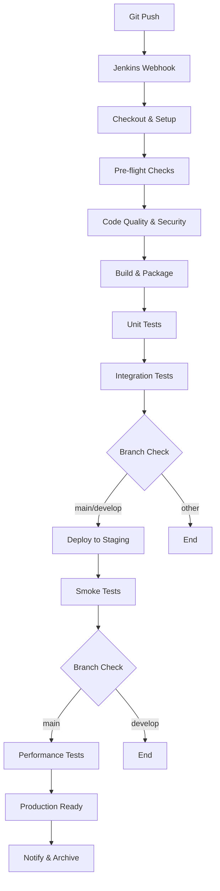

# Vienna Weather Monitoring System - Jenkins CI/CD

## 🚀 Overview
Automated CI/CD pipeline for Vienna Weather Monitoring System using Jenkins, Docker, and the ELK Stack.

## 🏗️ Architecture
```
GitHub → Jenkins Pipeline → Docker → ELK Stack → Monitoring
```

## 📋 Jenkins Pipeline Stages

### 1. **Checkout & Environment Setup**
- Clean workspace
- Checkout source code from Git
- Display project structure

### 2. **Pre-flight Checks** (Parallel)
- **Docker Environment**: Verify Docker and Docker Compose
- **Python Environment**: Setup Python and install dependencies
- **File Validation**: Ensure all required files are present

### 3. **Code Quality & Security** (Parallel)
- **Linting**: Python code quality checks with flake8
- **Security Scan**: Basic security and secrets detection

### 4. **Build & Package**
- Create build artifacts
- Generate version information
- Package application files

### 5. **Unit Tests**
- Run Python unit tests with pytest
- Generate test reports and coverage

### 6. **Integration Tests**
- Start test environment with Docker Compose
- Test service connectivity (Elasticsearch, RabbitMQ, Kibana)
- Run end-to-end integration tests

### 7. **Deploy to Staging** (main/develop branches only)
- Deploy to staging environment
- Verify deployment health

### 8. **Smoke Tests** (main/develop branches only)
- Test all service endpoints
- Verify OpenWeatherMap API connectivity
- Basic functionality validation

### 9. **Performance Tests** (main branch only)
- System resource monitoring
- Response time measurements

## 🔧 Setup Instructions

### Prerequisites
- Jenkins 2.400+
- Docker and Docker Compose
- Git
- Python 3.11+

### 1. Jenkins Setup

#### Install Required Plugins
```bash
# Core plugins
- Pipeline: Job
- Pipeline: Stage View
- Git
- Docker Pipeline
- Blue Ocean (optional, for better UI)

# Additional plugins
- JUnit
- Coverage
- Warnings Next Generation
- Timestamper
```

#### Create Credentials
In Jenkins → Manage Jenkins → Credentials:

1. **GitHub Credentials** (`github-credentials`)
   - Type: Username with password or SSH key
   - Username: Your GitHub username
   - Password/Key: GitHub token or SSH key

2. **OpenWeatherMap API Key** (`openweathermap-api-key`)
   - Type: Secret text
   - Secret: Your OpenWeatherMap API key
   - ID: `openweathermap-api-key`

3. **Docker Registry** (`docker-registry-url`) [Optional]
   - Type: Secret text
   - Secret: Your docker registry URL
   - ID: `docker-registry-url`

### 2. Create Jenkins Pipeline Job

#### Option A: Using Jenkins UI
1. New Item → Pipeline
2. Name: `vienna-weather-monitoring-cicd`
3. Pipeline → Definition: Pipeline script from SCM
4. SCM: Git
5. Repository URL: `https://github.com/shai1973private/OpenWeatherMap_jenkins.git`
6. Branch: `*/main`
7. Script Path: `Jenkinsfile`

#### Option B: Using Job Configuration (Recommended)
```bash
# Import the pre-configured job
curl -X POST "http://your-jenkins-url/createItem?name=vienna-weather-monitoring-cicd" \
     --user "username:password" \
     --header "Content-Type: application/xml" \
     --data-binary @jenkins-config.xml
```

### 3. Pipeline Configuration

#### Environment Variables
The pipeline uses these environment variables (configured in the Jenkinsfile):

```groovy
PROJECT_NAME = 'vienna-weather-monitoring'
API_KEY = credentials('openweathermap-api-key')
ELASTICSEARCH_URL = 'http://localhost:9200'
KIBANA_URL = 'http://localhost:5601'
RABBITMQ_URL = 'http://localhost:15672'
```

#### Build Triggers
- **SCM Polling**: Every 5 minutes (`H/5 * * * *`)
- **Scheduled Build**: Daily at 2 AM (`H 2 * * *`)
- **Manual Trigger**: Available anytime

## 📊 Monitoring & Notifications

### Pipeline Notifications
The pipeline sends notifications to Elasticsearch:
- Build start/completion
- Stage failures
- Performance metrics

### Index: `vienna-pipeline-notifications`
```json
{
  "pipeline_id": "123",
  "timestamp": "2023-10-16T12:00:00Z",
  "status": "SUCCESS|FAILURE|UNSTABLE",
  "stage": "stage_name",
  "build_version": "123-abc1234",
  "branch": "main",
  "project": "vienna-weather"
}
```

### Kibana Dashboards
Access pipeline metrics at:
- **Pipeline Overview**: `http://localhost:5601/app/dashboards#/view/jenkins-pipeline-overview`
- **Build History**: `http://localhost:5601/app/dashboards#/view/jenkins-build-history`

## 🧪 Testing

### Run Tests Locally
```bash
# Install test dependencies
pip install -r requirements.txt

# Run unit tests only
pytest tests/test_weather_system.py -v

# Run integration tests only
pytest tests/test_integration.py -v

# Run all tests with coverage
pytest tests/ --cov=. --cov-report=html

# Run specific test markers
pytest -m unit  # Unit tests only
pytest -m integration  # Integration tests only
```

### Test Environment
The pipeline uses `docker-compose.jenkins.yml` for testing:
- Reduced memory allocation for CI
- Health checks for all services
- Isolated test network

## 🚀 Deployment

### Staging Deployment
- Triggered automatically on `main` and `develop` branches
- Uses standard `docker-compose.yml`
- Includes smoke tests

### Production Deployment
- Manual trigger or separate pipeline
- Requires approval gates
- Blue-green deployment strategy (future enhancement)

## 🔍 Troubleshooting

### Common Issues

#### 1. Docker Permission Issues
```bash
# Add Jenkins user to docker group
sudo usermod -aG docker jenkins
sudo systemctl restart jenkins
```

#### 2. Port Conflicts
```bash
# Check for port usage
netstat -tulpn | grep -E ':(5601|9200|5672|15672)'

# Stop conflicting services
docker-compose down
```

#### 3. Memory Issues
```bash
# Monitor system resources
docker stats
free -h

# Adjust Docker memory limits in docker-compose.jenkins.yml
```

#### 4. API Rate Limits
```bash
# Check OpenWeatherMap API usage
curl "http://api.openweathermap.org/data/2.5/weather?q=Vienna,AT&appid=YOUR_API_KEY"

# Monitor API calls in pipeline logs
```

### Pipeline Debug Tips

1. **Enable Debug Logging**
   ```groovy
   // Add to Jenkinsfile
   options {
       buildDiscarder(logRotator(numToKeepStr: '10'))
       timeout(time: 30, unit: 'MINUTES')
       skipStagesAfterUnstable()
       parallelsAlwaysFailFast()
       timestamps()  // Add timestamps
   }
   ```

2. **Access Build Artifacts**
   - Navigate to Build → Artifacts
   - Download logs and test reports
   - Check coverage reports

3. **Container Logs**
   ```bash
   # View container logs
   docker-compose -f docker-compose.jenkins.yml logs elasticsearch
   docker-compose -f docker-compose.jenkins.yml logs kibana
   docker-compose -f docker-compose.jenkins.yml logs rabbitmq
   ```

## 📚 File Structure

### New Jenkins Files
```
vienna-weather-monitoring/
├── Jenkinsfile                    # Main pipeline definition
├── jenkins-config.xml             # Jenkins job configuration
├── docker-compose.jenkins.yml     # Testing environment
├── Dockerfile                     # Application container
├── requirements.txt               # Python dependencies
├── pytest.ini                     # Test configuration
├── tests/
│   ├── conftest.py               # Test configuration
│   ├── test_weather_system.py    # Unit tests
│   └── test_integration.py       # Integration tests
├── jenkins/
│   ├── setup-jenkins.ps1         # Jenkins setup script
│   └── plugins.txt               # Required Jenkins plugins
└── README_JENKINS.md             # This file
```

### Existing Files
```
├── weather_auto_rabbitmq.py       # Main application
├── simple-pipeline.py             # Original pipeline script
├── docker-compose.yml             # Production environment
├── pipeline-config.json           # Pipeline configuration
├── setup-elk.ps1                  # ELK setup script
└── logstash/                      # Logstash configuration
```

## 🔄 Pipeline Flow Diagram



## 📈 Future Enhancements

### Planned Features
1. **Blue-Green Deployment**
   - Zero-downtime deployments
   - Automatic rollback on failure

2. **Security Scanning**
   - Container vulnerability scanning
   - Dependency security checks
   - SAST/DAST integration

3. **Advanced Monitoring**
   - Prometheus metrics
   - Grafana dashboards
   - Alert notifications

4. **Multi-Environment Support**
   - Development, staging, production environments
   - Environment-specific configurations
   - Approval gates

5. **Load Testing**
   - Automated performance testing
   - Scalability validation
   - Resource optimization

## 🆘 Support

### Documentation
- [Jenkins Pipeline Documentation](https://www.jenkins.io/doc/book/pipeline/)
- [Docker Compose Reference](https://docs.docker.com/compose/)
- [Pytest Documentation](https://docs.pytest.org/)

### Contact
- Project Repository: [OpenWeatherMap_jenkins](https://github.com/shai1973private/OpenWeatherMap_jenkins)
- Issues: Create a GitHub issue for bugs or feature requests

---

**🌟 Happy Building! The pipeline is designed to be robust, scalable, and maintainable. Enjoy automated CI/CD for your Vienna Weather Monitoring System!**